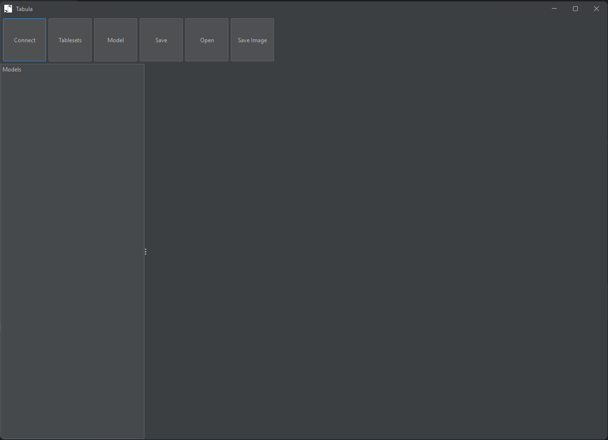
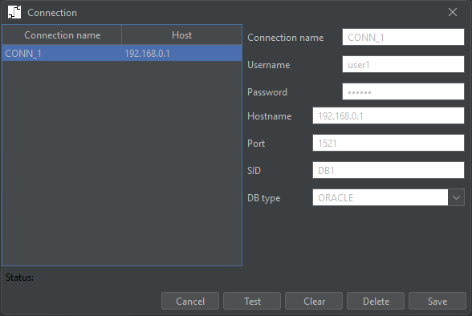
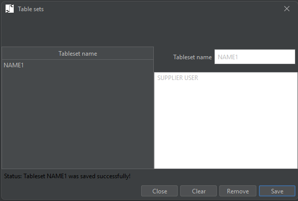
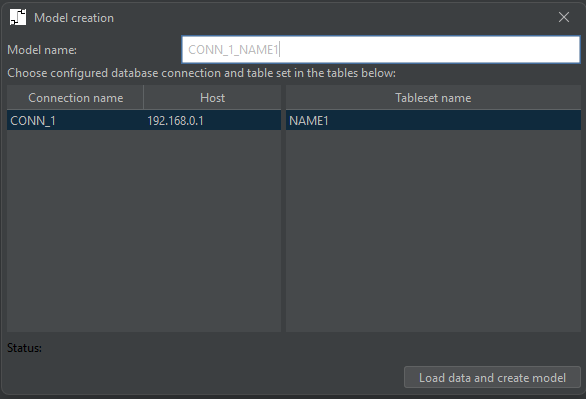
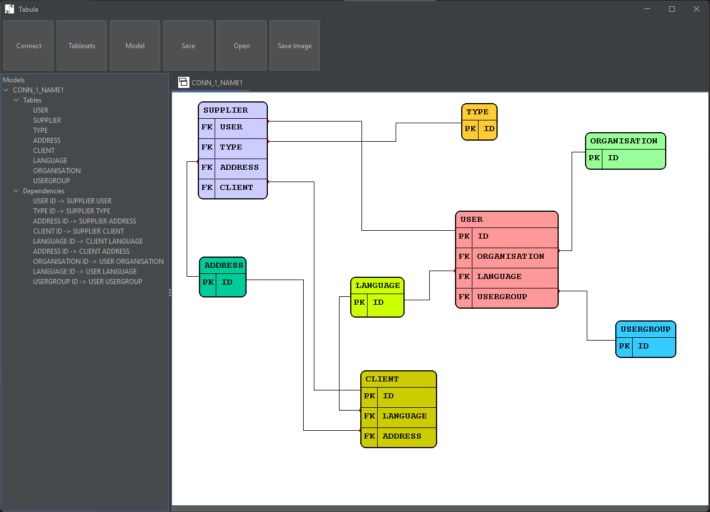

# Tabula
### Database visualization

## Features
The simple application to visualize your database tables and appropriate dependencies.
* Loading of DB tables with associated dependencies into the view area
* Removing of redundant tables
* Forwarding dependencies
* Saving as XML
* Opening saved model
* Saving as Image

## How to use
* Load the source code to your local computer.
* Build the executable jar file using the Maven tool.
* Open target directory -> executable jar file should be generated. It is important, that the folder "conf" is presented.
* Run the executable jar file Tabula-1.0-SNAPSHOT-jar-with-dependencies.jar

* Click on the "Connect" button. Connection dialog will be opened:

* Fill the DB data in the fields on the right side and save it. Close the connection dialog.
* Click on the "Tableset" button. Tableset dialog will be opened:

* Fill the tableset name, fill table names you need to visualize (whitespace separated), save it. Close the tableset dialog.
* Click on the "Model" button. Model creation dialog will be opened:

* Select the DB you need on the left side, select the tableset you need to visualize on the right side. Model name is generated automaticaly. You might change it.
* Click on the "Load data and create model" button.

## Additional opportunities
* Tables are placed with random coordinates after the loading from DB. After that you can move them manually via drag drop
* Dependencies could be moved as well
* You can change the color of each table (left click on the table (select table)) -> right click on the table -> color)
* If some of the tables are redundant, you can delete them (select table, right click -> Delete)
* If you need to investigate the dependencies in your DB, you can load additional tables with appropriate dependencies (select table -> right click -> forward)
* If you need to use the image (for example for the presentation), you can save the model as image (button "Save Image"). Before that it is remommended to fit the size of your model layout (right click on the layout (not on the table!) -> Fit layout size).
* There is the model tree on the left side of the application. It can be used to delete objects (tables and dependencies), or for the table search on the layout.

# Afterwords
This application is currently applicable for the Oracle DB. In the future it can be extended for other DB types.

I wich You a nice usage. 

### Developed by Konstantin Tomarevskii